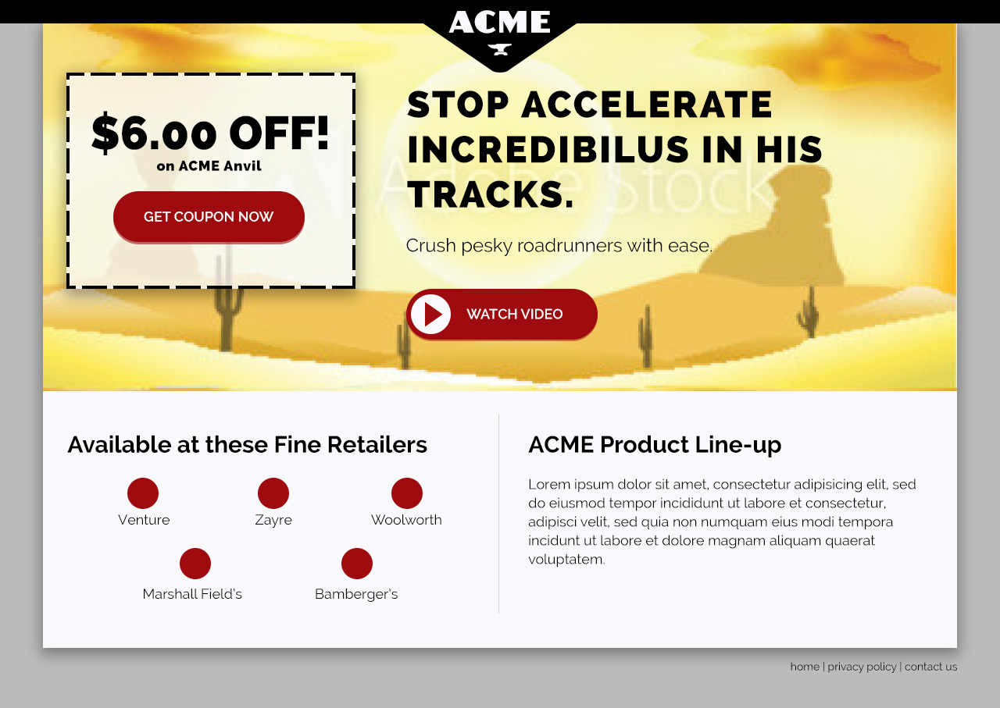

# Front-End Track

#### Phase 1
Wireframe Reference:

This section went by pretty well. I had to remind myself some Bootstrap fundementals. I had a little bit of a hiccup when it came to the bottom columns. I had only used flex once before(I think), and I had never used it with Bootstrap - so it was a learning moment for sure.

I played with the idea of pushing the columns when it came to the mobile version. My thought process on that was the client probably would want their header before the coupon.

##### Questions and Topics:

+ PHP uses and general practices. -- 12/2 Scott went over a lot of this
+ MAMP implementations, outside of server/database uses.
+ When using bootstrap, is it common to use flex? Should I implement at the beginning stages? Any way of doing this easily without flex(specifically with Bootstrap).
+ Getting started with Bootstrap, would be curious to see where others begin a project.

Would love any notes, feedback, and guidence on html & css practices. Anything look super hacky or amateur hour?

Confident in coding scale 1-10, Phase 1 was about an 8 or 9. I got stuck messing with margins and a few super minor bugs, but nothing I felt overwhelmed by.

#### Phase 2
Comp Reference:

This phase was great. I was able to get super nerdy into my naming conventions, and css styling. Probably could use some cleaning up still, any notes/pro-tips are welcomed. The beginning portion of this was a little shaky at best - setting up bower and gulp(Probably could use some more practice with it).

##### Questions and Topics:

+ Proper naming conventions for css styling, if any?
+ @Font-Face issues with Mozilla, any work arounds?(Research coming up limited)
+ I'd be interested in seeing/hearing some GULP usage in a real environment.
+ Normalize.css - setting everything to a zero level, useful?
+ Why @import is needed if gulp is concating everything? Outside of variable naming.
+ How much time does a dev spend on the front-end portion of a project, on average? Is it always adjusting?

Would love any notes, feedback, and guidence on html & css practices. Anything look super hacky or amateur hour?

Confident in coding scale 1-10, Phase 2 was about an 7. There was a lot of new concepts here. LESS, Bower, Gulp were all pretty new. I really started to get the hang of it about half way through.
